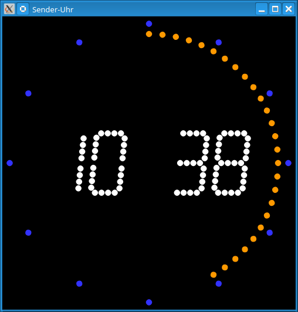

# Sender-Uhr
## Description

Sender-Uhr is a simple broadcast clock in a window.

I was frustrated that such a simple thing did not exists except for the Atomuhr app on IOS. Then I found OnAirScreen by astrastudio.de which basically is a full-fledged
broadcast clock in an appliance. I extracted just the clock from there.

Currently this works on Linux. Theoretically it is possible to use this code on Windows and OSX, too.

## How to run

* Download files from repository
* Set senderuhr startup script executeable
* Run senderuhr startup script

## Author(s)

This work is mainly a slight modification of a part of a larger project by Sascha Ludwig, https://astrastudio.de – please check out his great work.

Niels Ott, https://www.niels-ott.de, works in event tech, doing livestream broadcasting and other things… and needs a simple broadcast clock himself. 
